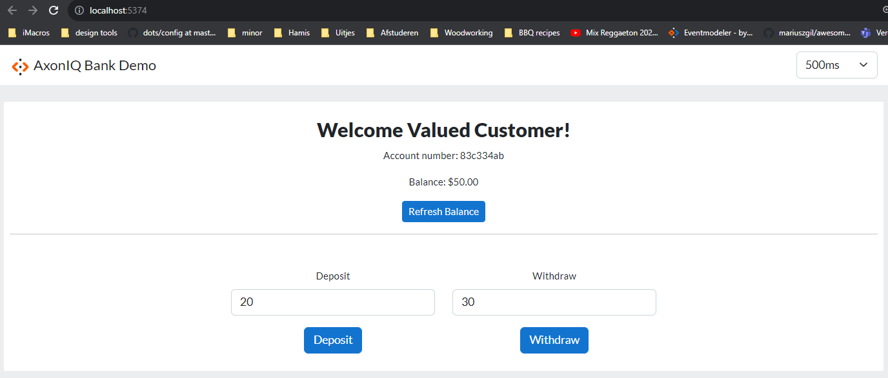

# Live-coding SSE AxonIQ Bank

This repository contains the code for my talk "Reactive applications with Event-Sourcing and CQRS". 
It is a live-coding session where I build a simple banking application using AxonIQ and show off
how we can leverage Server-sent events to build a reactive application.
This is done through Axon Framework Subscription Queries.

## How to run

- `mvn spring-boot:run` to start the backend application
- `cd frontend && npm run dev` to start the frontend application
- Now visit http://localhost:5374 to see the application in action

